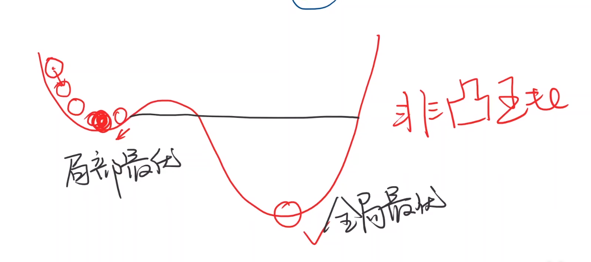
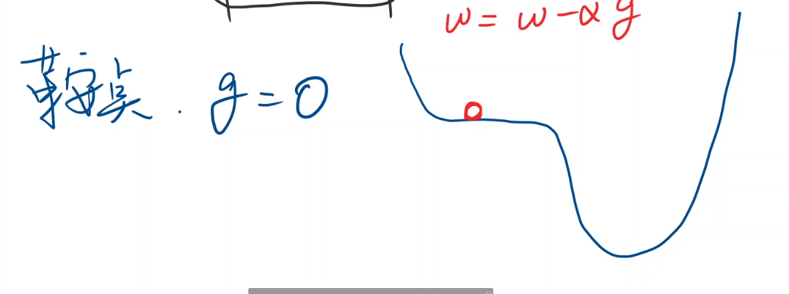
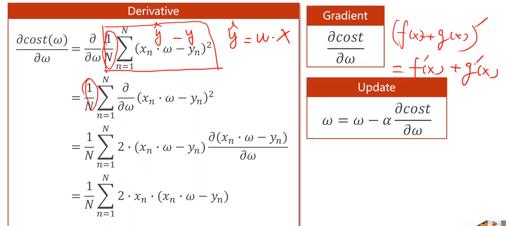
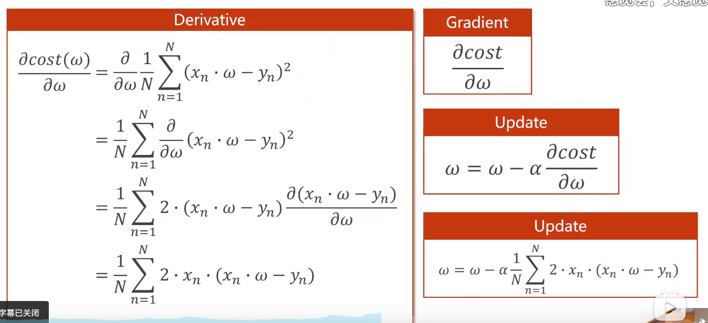
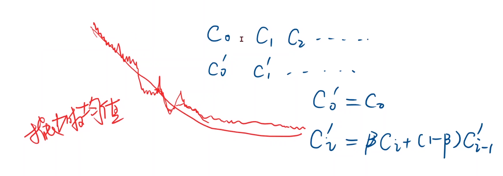
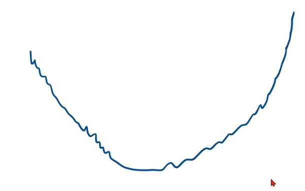
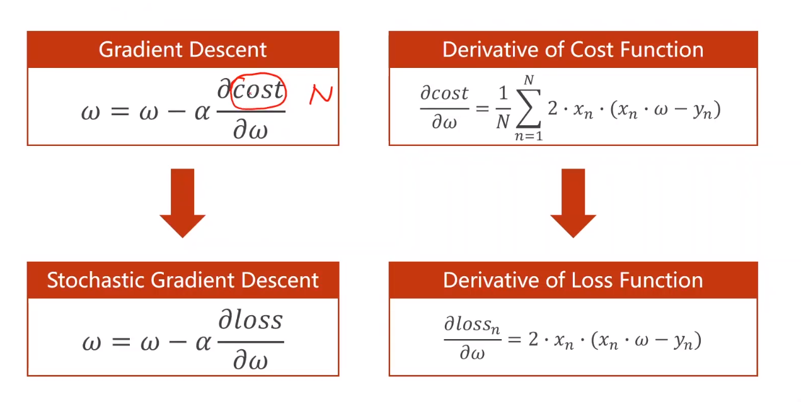
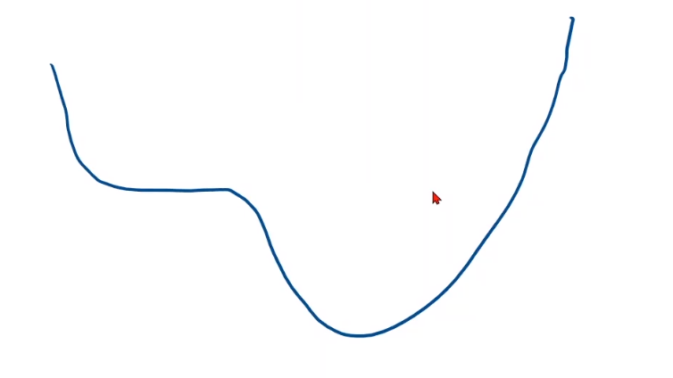
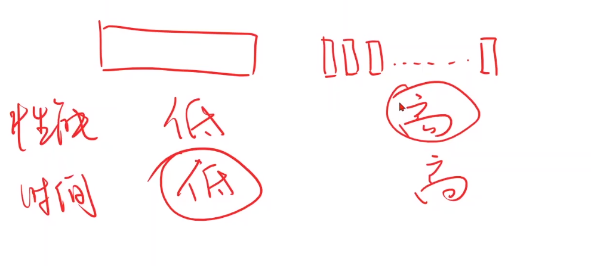

# 梯度下降
## 回顾
选模型（猜测什么模型是最佳的）

## 梯度下降只能找到局部最优，无法找到全局最优

深度学习很少局部最优点，但是会有鞍点

训练平滑曲线-指数加权均值的方法

如果如下图所示-训练发散，无法收敛-训练失败

最可能是学习率太大

随机梯度下降（常用）

一共n个数据，从里面随机选一个

更新公式变成拿单个样本的损失函数对权重进行求导，然后更新

为什么用随机梯度下降？

函数可能如下图

是带有鞍点的损失函数，拿到的数据总是有噪声的，有噪声就引入一个随机噪声，所有即使陷入鞍点，随机噪声可能会把我们向前推动，引入随机性之后，将来在更新的过程中，就有可能跨过这个鞍点，向最优值前进。

选择batch_size的原因（batch就是批量的随机梯度下降）

