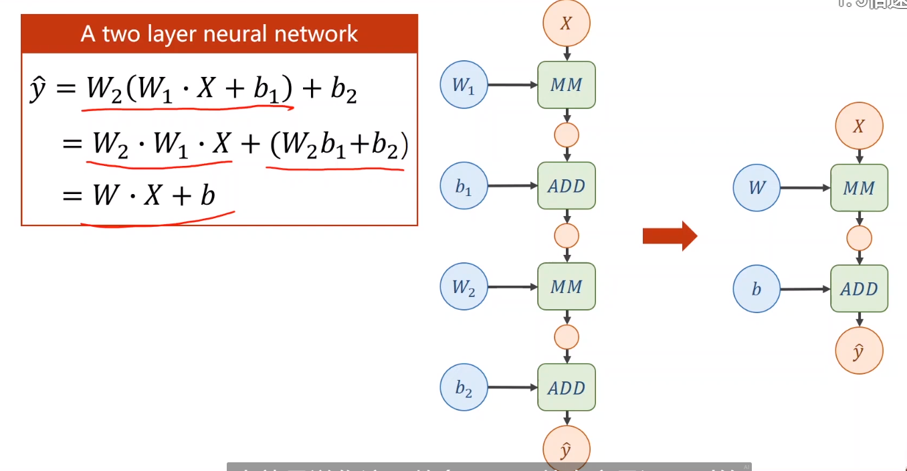
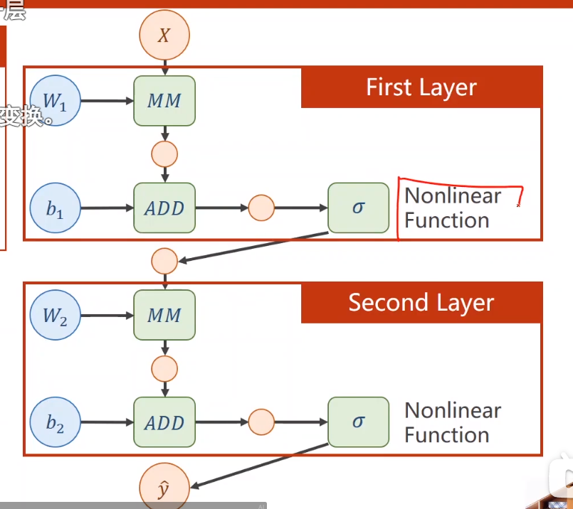
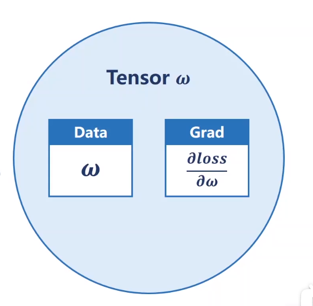

# 反向传播-解决导数难计算问题

- 矩阵的求导：http://www.math.uwaterloo.ca/~hwolkowi/matrixcookbook.pdf

- 层数多跟层数少没区别

- 为了解决上述问题，加激活函数

- pytorch基本数据类型Tensor，tensor类两个重要成员。data保存权重本身的值，不会建立计算图。grad保存损失函数对权重的导数，是一个Tensor，会建立计算图。定义了Tensor就可以建立计算图。

