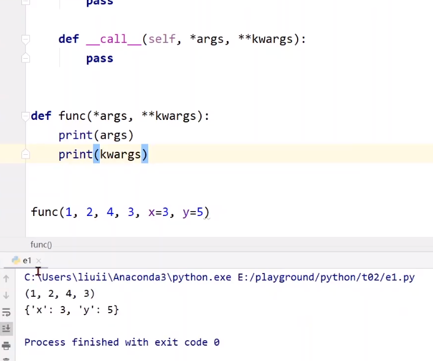

# 步骤

1.构建数据集

2.设计模型（不是计算损失，计算y^）

3.构造损失函数和优化器（使用pytorch API）

4.训练周期（前馈，反馈，更新）

## 广播

- 上图两矩阵不能做加法，得做广播

- 向量化

- 模型模版类，最少实现下面两个函数，构造函数初始化对象时默认调用的函数，forward是在进行前馈的过程中所要执行的计算。
- 没有backward
- 因为model实现的对象会自动根据里面的计算图帮你实现backward的过程

- pytorch中用的一些模块没有定义(没办法求导数)
- 1.如果模块可以由一些基本python支持的运算来构成，可以把它封装成一个model，将来可以去实例化这个model，然后调用它，它可以自动来进行反向传播。
- 2.有时候觉得pytorch计算图效率不高，在计算导数有更高效的方法，可以从functions里面来进行继承，functions也是pytorch里面的一个类，不是函数。在这个类中需要实现反向传播，可以构造自己的计算块，但是如果基本的计算块都是可以由现成的pytorch语言的计算模块构成，进行串行运算或者其他一些运算方式能构成的话，用model是最简单的。因为不用人工设计反向传播的导数怎么求。

- *args表示不知道几个参数，变成一个元组。1，2，4，3
- **kwargs变成一个词典。x=3,y=5

