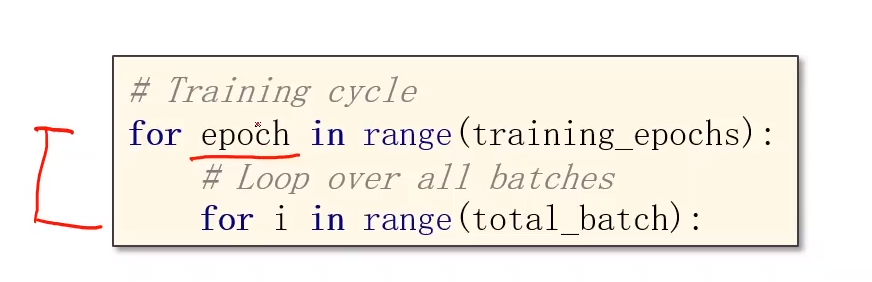
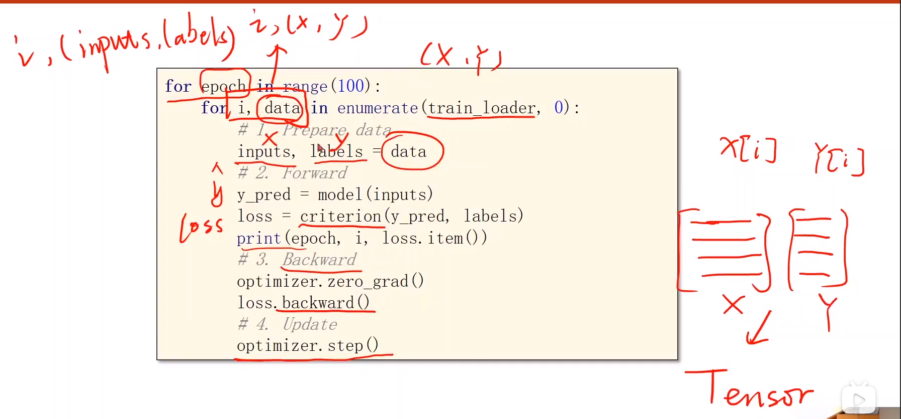

# 加载数据----构造Dataset和DataLoader
## Dataset----构造数据集（支持索引）。
## DataLoader----拿出一个mini-batch一组数据训练时使用。
## Epoch----所有训练样本都进行了一次前向传播和反向传播，整个过程叫一个Epoch（所有样本都参与了训练）
## Batch-Size----每次训练时所用样本数量（进行一次前馈，一次反馈，一次更新）
## Iterations----batch一共分了多少个（内层迭代一共执行多少次）

```
假如10000个样本，每次的batch是1000个，Iterations就是10
```

- 嵌套循环，外面是一次epoch,里面是batch


