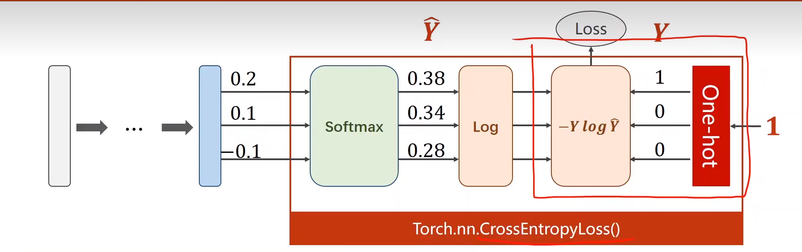
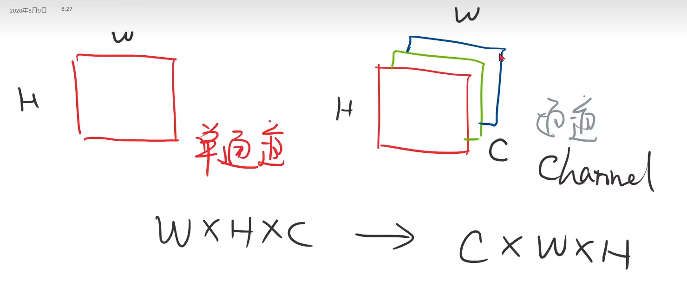
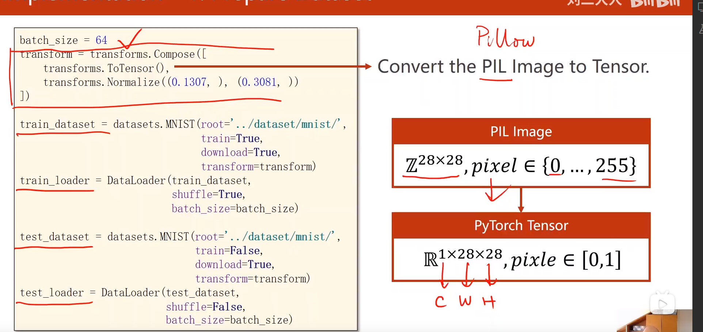

## torch.nn.CrossEntropyLoss()包含softmax了，使用交叉熵损失时，最后一层不要做激活。

## 交叉熵损失处理注意
- 1.y需要是 long Tensor ,是一个长整型的张量
- 2.在构造时，直接使用CrossEntropy损失就可以
  

- PIL和OPENCV读进来的张量w*h*c,在pytorch中要转化成c*w*h,这是为了在pytorch中进行更高效的图像处理卷积运算而进行的一个转换。
- 所有拿到图像后，先把它变成一个pytorch里的tensor
  
  

  
  所以要做两个操作

  1.把0-255压缩成0-1

  2.把28*28变成1*28*28的张量

  上述过程可以用transforms所提供的totensor对象来进行实现